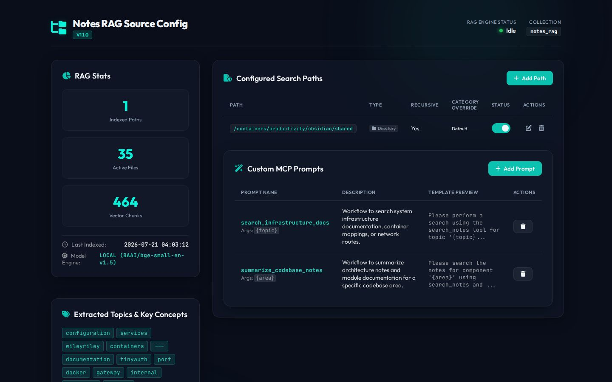

# Notes RAG MCP Server

[](https://github.com/spelech/notes-rag-mcp/actions/workflows/docker-publish.yml)
[](https://github.com/spelech/notes-rag-mcp/pkgs/container/notes-rag-mcp)

A high-performance Model Context Protocol (MCP) server for semantic search, dynamic topic cataloging, and context retrieval over markdown notes and system documentation.



---

## 🌟 Key Features

- **Local ONNX Embedding Engine (FastEmbed)**: In-process CPU-optimized vector embedding using models like `BAAI/bge-small-en-v1.5` (384 dimensions). Zero external network latency, zero API costs, and zero rate limits. Includes optional OpenAI / LiteLLM API fallback.
- **Dynamic Topic & Keyword Extraction Engine**: Automatically tokenizes indexed documents, extracts section headings, frontmatter tags, categories, and high-frequency key concepts into a persistent SQLite index.
- **Self-Describing Dynamic MCP Tools**: Dynamically updates the `search_notes` description in `tools/list` to list real document titles (e.g., `container_mapping.md`, `network_routes.md`) and key concepts. This allows semantic gateway routers (like `mcp-router`) to automatically match search queries to `notes-rag-mcp`.
- **Contextual Chunk Embeddings**: Prepends document titles, folder paths, section headings, and tags directly to chunk text before embedding to maximize vector search accuracy for section titles and header queries.
- **MCP Resources & Prompts**:
  - **Resource**: `notes://catalog/summary` — Returns a comprehensive markdown table catalog of indexed files, categories, tags, and key concepts.
  - **Prompt**: `search_infrastructure_docs` — Ready-made prompt workflow to query system architecture, container mappings, or network routes.
- **Incremental & Concurrent Indexing**: SQLite cache avoids re-embedding unchanged files, while multi-threaded thread pools parallelize processing.
- **Dark-Mode Admin Dashboard**: Built-in glassmorphic UI at `/admin/` featuring real-time RAG statistics, path management, interactive directory browser, and a live topic tag cloud.

---

## 🛠️ Tools, Resources & Prompts

### Tools
- `search_notes`: Perform semantic search across indexed documentation, notes, and codebase files. Accepts natural language `query`, optional `folder`, `tag`, `category`, and `limit`.
- `trigger_reindex`: Force an immediate scan of configured source directories to index new or updated files.
- `index_status`: Get indexing statistics, active embedding provider (`LOCAL` vs `API`), and collection details.

### Resources
- `notes://catalog/summary`: Markdown catalog listing all active documents, categories, tags, and top key concepts.

### Prompts
- `search_infrastructure_docs`: Automated prompt template to assist LLM agents in querying infrastructure documentation.

---

## ⚙️ Environment Variables

| Variable | Description | Default |
| --- | --- | --- |
| `EMBEDDING_PROVIDER` | Embedding engine (`local` for in-process ONNX, `api` for LiteLLM/OpenAI) | `local` |
| `EMBEDDING_MODEL` | FastEmbed or API embedding model name | `BAAI/bge-small-en-v1.5` |
| `QDRANT_URL` | URL to the Qdrant vector database | `http://qdrant:6333` |
| `LITELLM_URL` | Base URL for OpenAI/LiteLLM API fallback | `http://litellm:4000/v1` |
| `LITELLM_API_KEY` | API Key for embeddings | `dummy` |
| `COLLECTION_NAME` | Qdrant collection name | `notes_rag` |
| `VAULT_PATH` | Default path to the markdown documentation directory | `/docs` |
| `CACHE_DB_PATH` | Path to persistent SQLite cache database | `/app/data/index_cache.db` |
| `CHUNK_SIZE` | Maximum character length per text chunk | `1500` |
| `CHUNK_OVERLAP` | Character overlap between consecutive chunks | `200` |

---

## 🚀 Running via Docker

### Using Pre-built Container (GHCR)
```bash
docker run -d \
  --name notes-rag-mcp \
  -p 3000:3000 \
  -e EMBEDDING_PROVIDER=local \
  -v /path/to/my/docs:/docs:ro \
  -v ./data:/app/data \
  ghcr.io/spelech/notes-rag-mcp:latest
```

### Docker Compose
```yaml
services:
  notes-rag-mcp:
    image: ghcr.io/spelech/notes-rag-mcp:latest
    container_name: notes-rag-mcp
    restart: unless-stopped
    ports:
      - "8021:3000"
    environment:
      - EMBEDDING_PROVIDER=local
      - EMBEDDING_MODEL=BAAI/bge-small-en-v1.5
      - QDRANT_URL=http://qdrant:6333
      - VAULT_PATH=/docs
    volumes:
      - /path/to/my/docs:/docs:ro
      - ./data:/app/data
```

---

## 📡 Connecting MCP Clients

Connect any MCP-compliant client (VS Code, Cursor, Antigravity CLI, or Claude Desktop) to the Server-Sent Events (SSE) endpoint:

```json
{
  "mcpServers": {
    "notes-rag": {
      "url": "http://localhost:3000/sse",
      "type": "sse",
      "trust": true
    }
  }
}
```

---

## 📝 Changelog

- **v1.2.0**:
  - Added dynamic custom MCP prompt storage in SQLite (`custom_prompts` table).
  - Seeded default infrastructure and codebase prompt templates on DB initialization.
  - Implemented dynamic `@mcp_server.list_prompts()` and `@mcp_server.get_prompt()` handlers.
  - Added prompt management REST APIs (`GET`, `POST`, `DELETE` `/admin/api/prompts`).
  - Added Custom MCP Prompts card and modal to the Admin Dashboard.
- **v1.1.0**:
  - Integrated FastEmbed in-process CPU local ONNX embedding engine (`BAAI/bge-small-en-v1.5`).
  - Added topic & keyword extraction engine (`file_summaries` SQLite table).
  - Implemented dynamic MCP tool description updates in `list_tools()` for improved discovery by gateway routers.
  - Added contextual chunk embeddings with document title and section breadcrumbs.
  - Added MCP Resource (`notes://catalog/summary`).
  - Implemented GitHub Actions CI/CD docker build & publish workflow (`ghcr.io`).
  - Updated admin dashboard UI with Extracted Topics tag cloud and model engine indicator.

- **v1.0.1**:
  - Updated Python MCP SDK SSE transport method to `connect_sse` for compatibility with modern MCP clients.
